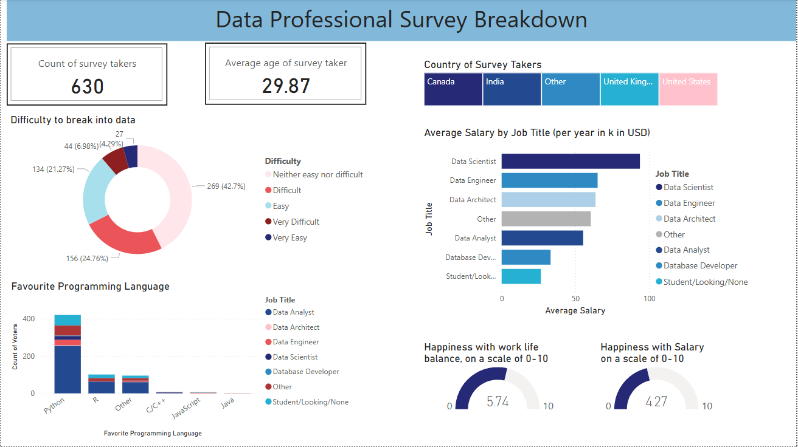

# Survey of Data professionals

## Objective

To analyze the dataset through a PowerBI dashboard and get insights on the data

## What is being done?

* Data cleaning and transformation through Power Query
* Visualization creation though PowerBI Dashboard

## Dataset details

* Format: .xlsx
* Size: Rows x columns - 630 x 28

## Dashboard Screenshot

    

### References

https://www.youtube.com/watch?v=pixlHHe_lNQ&t=335s&ab_channel=AlexTheAnalyst   

